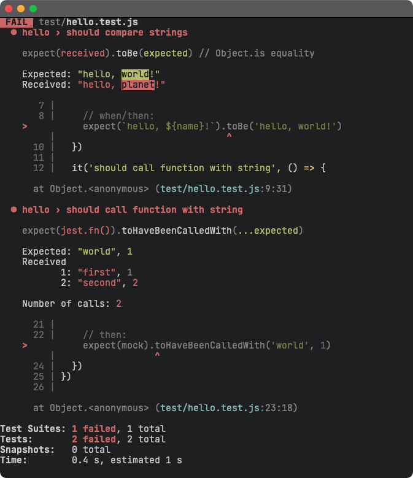
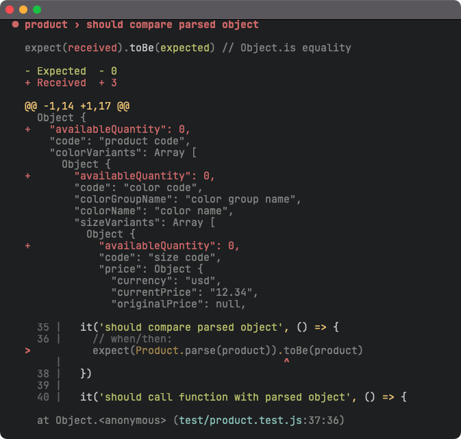
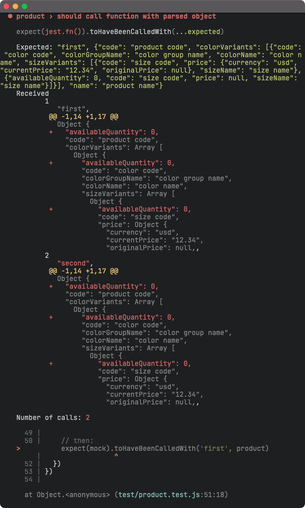

## jest-playground

Setup environment.

```
❯ node --version
v17.6.0

❯ yarn --version
1.22.17
```

Install dependencies.

```
❯ yarn install
```

Run test suite.

```
❯ yarn jest --silent --watchAll
```

Run code formatter.

```
❯ yarn prettier . --write
```

### Test Result Outputs







### References

- Rico Sta. Cruz (Apr 2021): ["Setting up Jest with ESM"](https://gist.github.com/rstacruz/511f43265de4939f6ca729a3df7b001c)
